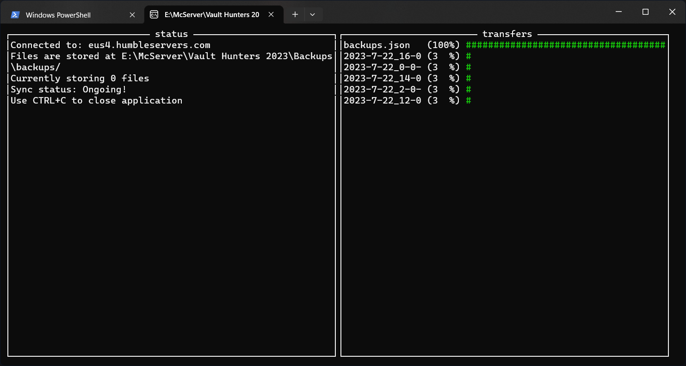

## SyncSFTP 

Simple command line utility to keep a folder on a SFTP server in sync with your local machine made using .NET 7.0.x. To run this on boot, add a shortcut to the executable in the startup folder (Windows key + R and then type `shell:startup`)

> The application doesn't really sync though, it only downloads any new files it finds (so no comparing write datums). Also, it doesn't purge files.

A config file is generated for you to put your data in.

